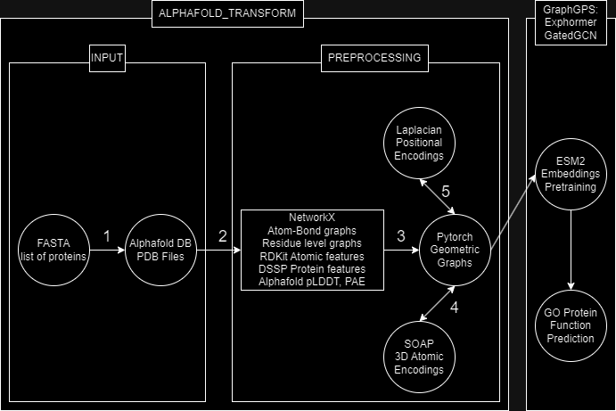

# alphafold-transform
Functions for converting Alphafold PDB molecules into graph representations for use with graph networks.

```bash

# Requirements (In colab)
pip install pyg-lib torch_scatter torch_sparse torch_cluster torch_spline_conv -f https://data.pyg.org/whl/torch-2.1.0+cu118.html
pip install torch-geometric
pip install rdkit
pip install Bio
sudo apt-get install dssp
pip install iterative-stratification
pip install ase
pip install dscribe

```




```bash

import alphafold_transform as at

# 1
at.fasta_alpha(input_fasta=".fasta", base_directory="")

# 2
at.alpha_nx(input_directory="", output_directory="")

# 3
at.nx_pyg(input_dir="", output_dir="")

# 4
at.soap_local(input_directory="", output_directory="")

# 5 (gpu)
at.precompute_eigens(input_dir="")


# Task specific:

at.minmax_norm(input_dir="", output_dir="")

at.GO_split(input_directory="")

at.go_labels(input_directory="", output_directory="", train_terms=".tsv")

at.delete_y(directory="")

at.esm2_labels(embeddings_path=".npy", sequence_ids_path=".npy", input_dir="")
