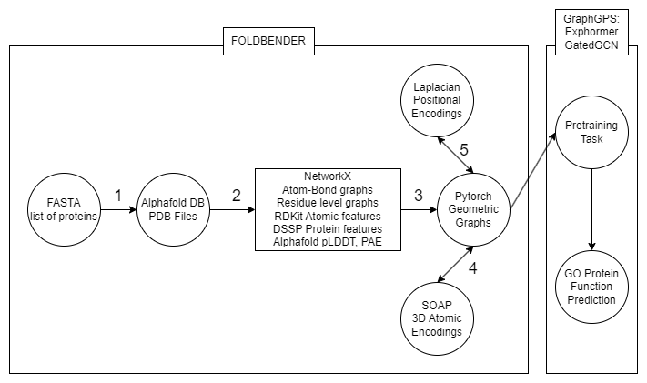

# Foldbender
Functions for converting Alphafold PDB molecules into graph representations for use with graph networks.

```bash

# Requirements (In colab)
pip install pyg-lib torch_scatter torch_sparse torch_cluster torch_spline_conv -f https://data.pyg.org/whl/torch-2.1.0+cu118.html
pip install torch-geometric
pip install rdkit
pip install Bio 
sudo apt-get install dssp
pip install iterative-stratification
pip install ase
pip install dscribe

```




```bash

import foldbender as fb

# 1
fb.fasta_alpha(input_fasta=".fasta", input_dir="")

# 2
fb.alpha_nx(input_dir="", output_dir="")

# 3
fb.nx_pyg(input_dir="", output_dir="")

# 4
fb.soap_local(input_dir="", r_cut=3, n_max=3, l_max=3, sigma=0.1)

# 5 (gpu)
fb.precompute_eigens(input_dir="")


# Task specific:

fb.minmax_norm(input_dir="")

fb.go_split(input_dir="")

fb.go_labels(input_dir="", train_terms=".tsv")

fb.esm2_labels(embeddings_path=".npy", sequence_ids_path=".npy", input_dir="")

fb.foldseek_targets(file_clusters=".tsv", file_scores=".tsv")

fb.foldseek_multiclass_labels(input_dir="", foldseek_targets=".tsv")

fb.foldseek_regression_labels(input_dir="", foldseek_targets=".tsv")

fb.foldseek_multiclass_split(input_dir="", valid_size=0.3, test_size=0.3, random_state=42)
